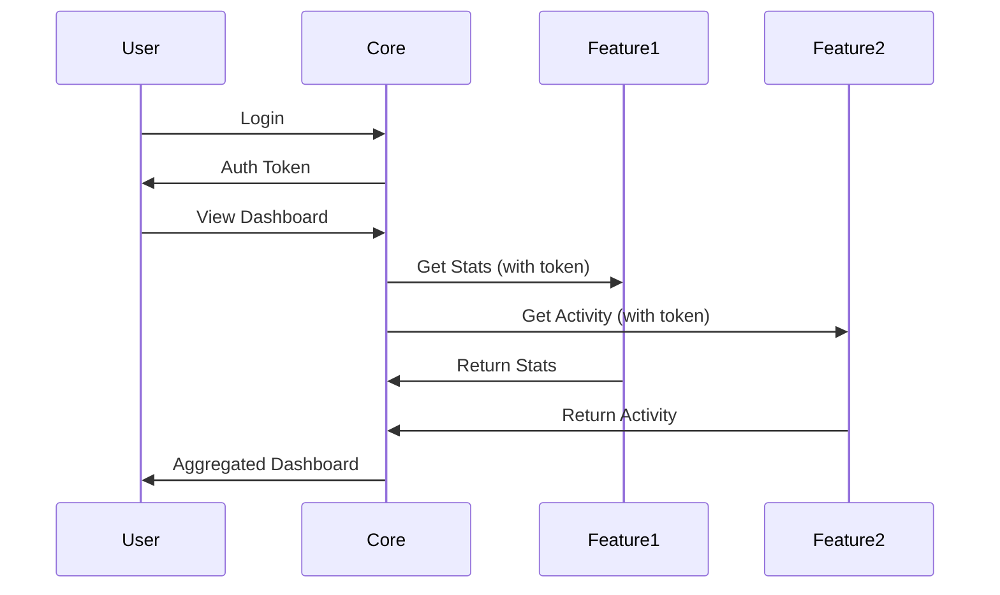

# 🌌 Galaxy Architecture Guide

> A comprehensive guide to building interconnected micro-products using the Galaxy System architecture

## 📚 Table of Contents

1. [Understanding the Galaxy System](#understanding-the-galaxy-system)
2. [Core vs Feature Apps](#core-vs-feature-apps)
3. [Setting Up a Core App](#setting-up-a-core-app)
4. [Setting Up a Feature App](#setting-up-a-feature-app)
5. [Communication & Integration](#communication--integration)
6. [Best Practices](#best-practices)
7. [Real-World Examples](#real-world-examples)
8. [Troubleshooting](#troubleshooting)

## 🌍 Understanding the Galaxy System

The Galaxy System is an architectural pattern for building a suite of interconnected micro-products that work independently yet seamlessly integrate with each other.

### Key Concepts

```
┌─────────────────────────────────────────────────────────┐
│                     GALAXY SYSTEM                        │
├─────────────────────────────────────────────────────────┤
│                                                          │
│           ┌──────────────────────┐                      │
│           │     CORE APP         │                      │
│           │   (Galaxy Center)    │                      │
│           │                      │                      │
│           │  - User Management   │                      │
│           │  - Central Dashboard │                      │
│           │  - Feature Discovery │                      │
│           └──────────┬───────────┘                      │
│                      │                                  │
│        ┌─────────────┼─────────────┐                    │
│        │             │             │                    │
│   ┌────▼────┐   ┌───▼────┐   ┌───▼────┐              │
│   │Feature 1│   │Feature 2│   │Feature 3│              │
│   │(Planet) │   │(Planet) │   │(Planet) │              │
│   └─────────┘   └─────────┘   └─────────┘              │
│                                                          │
│   Independent apps that integrate via API               │
└─────────────────────────────────────────────────────────┘
```

### Benefits

- **Modularity**: Each feature is independently deployable
- **Scalability**: Add new features without modifying existing code
- **Flexibility**: Features can be used standalone or integrated
- **Marketing**: Cross-promotion and upselling opportunities
- **Development**: Teams can work on features independently

## 🎯 Core vs Feature Apps

### Core App (Galaxy Center)

The Core App is the central hub of your galaxy system:

**Purpose:**
- Central authentication and user management
- Dashboard aggregating all feature data
- Feature discovery and promotion
- Billing and subscription management (if applicable)
- Analytics and usage tracking

**Characteristics:**
- `type: 'core'` in galaxy.config.ts
- Lists all feature apps in `related` array
- Promotes features via `promoteFeatures` array
- Provides central API orchestration
- Manages user sessions across features

### Feature App (Planet)

Feature Apps are specialized micro-products:

**Purpose:**
- Solve a specific problem or provide specific functionality
- Can operate independently
- Expose APIs for integration
- Can promote the core and other features

**Characteristics:**
- `type: 'feature'` in galaxy.config.ts
- References the core app URL
- Exposes API endpoints for integration
- Can work standalone or integrated
- Lightweight and focused

## 🏗️ Setting Up a Core App

### Step 1: Clone and Configure

```bash
# Clone the template
git clone https://github.com/your-org/template-core my-galaxy-core
cd my-galaxy-core
npm install
```

### Step 2: Configure galaxy.config.ts

```typescript
// src/config/galaxy.config.ts
export const galaxyConfig: GalaxyConfig = {
  id: 'my-galaxy-core',
  type: 'core', // Important: Set as core
  name: 'My Galaxy Suite',
  tagline: 'All your tools in one place',
  description: 'A comprehensive suite of productivity tools',
  coreAppUrl: 'https://my-galaxy.com',
  
  // Theme configuration
  colorPalette: {
    primary: '#3B8247',
    secondary: '#82673B',
    accent: '#F59E0B',
    background: '#353f50',
    foreground: '#fffdee',
    muted: '#9CA3AF',
    success: '#10B981',
    warning: '#F59E0B',
    error: '#EF4444',
  },
  
  // Features to promote in the dashboard
  promoteFeatures: ['feature-1-id', 'feature-2-id'],
  
  // All related feature apps
  related: [
    {
      id: 'feature-1-id',
      name: 'Feature One',
      url: 'https://feature1.my-galaxy.com',
      apiEndpoint: 'https://feature1.my-galaxy.com/api/integrate',
      description: 'Does amazing things',
      icon: 'Sparkles' // Lucide icon name
    },
    {
      id: 'feature-2-id',
      name: 'Feature Two',
      url: 'https://feature2.my-galaxy.com',
      apiEndpoint: 'https://feature2.my-galaxy.com/api/integrate',
      description: 'Does other amazing things',
      icon: 'Zap'
    }
  ]
};
```

### Step 3: Set Up Authentication

```bash
# Configure Clerk authentication
cp env.template .env.local
```

Edit `.env.local`:
```env
NEXT_PUBLIC_CLERK_PUBLISHABLE_KEY=your_publishable_key
CLERK_SECRET_KEY=your_secret_key
NEXT_PUBLIC_CLERK_SIGN_IN_URL=/sign-in
NEXT_PUBLIC_CLERK_SIGN_UP_URL=/sign-up
NEXT_PUBLIC_CLERK_AFTER_SIGN_IN_URL=/dashboard
NEXT_PUBLIC_CLERK_AFTER_SIGN_UP_URL=/dashboard
```

### Step 4: Implement Feature Integration

```typescript
// src/app/dashboard/page.tsx
import { callGalaxyFeature, batchCallFeatureAPIs } from '@/lib/fetchers';

export default async function Dashboard() {
  // Get data from all features
  const featureData = await batchCallFeatureAPIs([
    {
      endpoint: 'https://feature1.my-galaxy.com/api/dashboard-stats',
      payload: { userId: user.id }
    },
    {
      endpoint: 'https://feature2.my-galaxy.com/api/recent-activity',
      payload: { userId: user.id, limit: 5 }
    }
  ]);
  
  return (
    <div>
      {/* Aggregate and display feature data */}
    </div>
  );
}
```

### Step 5: Create API Orchestration

```typescript
// src/app/api/orchestrate/route.ts
import { NextResponse } from 'next/server';
import { callGalaxyFeature } from '@/lib/fetchers';

export async function POST(req: Request) {
  const { feature, action, data } = await req.json();
  
  // Call the appropriate feature
  const result = await callGalaxyFeature(feature, {
    action,
    ...data
  });
  
  return NextResponse.json(result);
}
```

## 🛸 Setting Up a Feature App

### Step 1: Clone and Configure

```bash
# Clone the template for a feature
git clone https://github.com/your-org/template-core my-galaxy-feature
cd my-galaxy-feature
npm install
```

### Step 2: Configure as Feature

```typescript
// src/config/galaxy.config.ts
export const galaxyConfig: GalaxyConfig = {
  id: 'my-feature',
  type: 'feature', // Important: Set as feature
  name: 'My Feature App',
  tagline: 'Specialized tool for X',
  description: 'Detailed description of what this feature does',
  
  // Reference to the core app
  coreAppUrl: 'https://my-galaxy.com',
  
  // This feature's API endpoint
  apiEndpoint: 'https://my-feature.com/api/integrate',
  
  // Use same color palette as core for consistency
  colorPalette: {
    primary: '#3B8247',
    secondary: '#82673B',
    accent: '#F59E0B',
    background: '#353f50',
    foreground: '#fffdee',
    muted: '#9CA3AF',
    success: '#10B981',
    warning: '#F59E0B',
    error: '#EF4444',
  },
  
  // Promote the core app
  promoteCore: true,
  
  // Optionally promote other features
  promoteFeatures: ['other-feature-id'],
  
  // Other features in the galaxy (optional)
  related: [
    {
      id: 'core',
      name: 'Galaxy Dashboard',
      url: 'https://my-galaxy.com',
      description: 'Access all your tools'
    }
  ]
};
```

### Step 3: Create Integration API

```typescript
// src/app/api/integrate/route.ts
import { NextResponse } from 'next/server';
import { auth } from '@clerk/nextjs';

export async function POST(req: Request) {
  // Verify the request is from the core app
  const { userId } = auth();
  
  if (!userId) {
    return NextResponse.json({ error: 'Unauthorized' }, { status: 401 });
  }
  
  const { action, ...params } = await req.json();
  
  switch (action) {
    case 'getDashboardStats':
      // Return stats for the core dashboard
      return NextResponse.json({
        totalItems: 42,
        recentActivity: 5,
        status: 'active'
      });
      
    case 'getRecentItems':
      // Return recent items
      return NextResponse.json({
        items: [
          { id: 1, name: 'Item 1', created: new Date() },
          { id: 2, name: 'Item 2', created: new Date() }
        ]
      });
      
    default:
      return NextResponse.json({ 
        error: 'Unknown action' 
      }, { status: 400 });
  }
}
```

### Step 4: Add Core Promotion

```typescript
// src/components/core-promotion.tsx
import { galaxyConfig } from '@/config/galaxy.config';
import Link from 'next/link';

export function CorePromotion() {
  if (!galaxyConfig.promoteCore) return null;
  
  return (
    <div className="bg-primary/10 p-4 rounded-lg">
      <h3 className="font-semibold text-primary">
        Part of {galaxyConfig.coreAppUrl}
      </h3>
      <p className="text-muted-foreground">
        Access all your tools from one dashboard
      </p>
      <Link 
        href={galaxyConfig.coreAppUrl}
        className="text-accent hover:underline"
      >
        Visit Galaxy Dashboard →
      </Link>
    </div>
  );
}
```

### Step 5: Implement Standalone Mode

```typescript
// src/app/page.tsx
export default function HomePage() {
  const isStandalone = !galaxyConfig.coreAppUrl;
  
  return (
    <div>
      {isStandalone ? (
        <StandaloneHero />
      ) : (
        <IntegratedHero />
      )}
    </div>
  );
}
```

## 🔗 Communication & Integration

### API Communication Flow



### Shared Authentication

Using Clerk, you can share authentication across apps:

```typescript
// Core App - Pass session to features
const sessionToken = await auth().sessionId;
const featureUrl = `${feature.url}?session=${sessionToken}`;
```

```typescript
// Feature App - Validate session
import { auth } from '@clerk/nextjs';

const { userId, sessionId } = auth();
if (!userId) {
  redirect('/sign-in');
}
```

### Data Synchronization

```typescript
// Core app - Sync user data
async function syncUserAcrossFeatures(userId: string) {
  const features = galaxyConfig.related || [];
  
  await Promise.all(
    features.map(feature => 
      callFeatureAPI(feature.apiEndpoint, {
        action: 'syncUser',
        userId,
        userData: {
          email: user.email,
          name: user.name,
          preferences: user.preferences
        }
      })
    )
  );
}
```

## 💡 Best Practices

### 1. Consistent Theming

Always use the same color palette across all apps:

```typescript
// Share this config across all apps
const sharedColorPalette = {
  primary: '#3B8247',
  secondary: '#82673B',
  accent: '#F59E0B',
  // ... rest of colors
};
```

### 2. API Versioning

Version your integration APIs:

```typescript
// src/app/api/v1/integrate/route.ts
export async function POST(req: Request) {
  // v1 implementation
}

// src/app/api/v2/integrate/route.ts
export async function POST(req: Request) {
  // v2 implementation with backward compatibility
}
```

### 3. Error Handling

Implement graceful degradation:

```typescript
async function getFeatureData(feature: RelatedFeature) {
  try {
    return await callFeatureAPI(feature.apiEndpoint, { 
      action: 'getData' 
    });
  } catch (error) {
    console.error(`Failed to fetch from ${feature.name}:`, error);
    return {
      error: true,
      message: `${feature.name} is currently unavailable`,
      fallbackData: {}
    };
  }
}
```

### 4. Feature Flags

Use feature flags for gradual rollouts:

```typescript
const features = {
  enableFeature1: process.env.ENABLE_FEATURE_1 === 'true',
  enableFeature2: process.env.ENABLE_FEATURE_2 === 'true',
};

// In your component
{features.enableFeature1 && <Feature1Integration />}
```

### 5. Performance Optimization

Cache feature data:

```typescript
import { unstable_cache } from 'next/cache';

const getCachedFeatureData = unstable_cache(
  async (featureId: string) => {
    return await callGalaxyFeature(featureId, { 
      action: 'getData' 
    });
  },
  ['feature-data'],
  {
    revalidate: 60, // Cache for 60 seconds
    tags: ['feature-data']
  }
);
```

## 🌟 Real-World Examples

### Example 1: Job Application Suite

**Core App: GYST (Get Your Stuff Together)**
- Central dashboard for job search
- Track applications across all tools
- Unified analytics and insights

**Feature Apps:**
1. **CV Generator**
   - Create and manage CVs
   - API: Provides CV count, recent edits
   
2. **Cover Letter AI**
   - Generate cover letters
   - API: Provides letter count, templates used
   
3. **Interview Prep**
   - Practice interviews
   - API: Provides practice sessions, scores

### Example 2: Content Creation Suite

**Core App: Content Hub**
- Content calendar
- Publishing scheduler
- Analytics dashboard

**Feature Apps:**
1. **AI Writer**
   - Generate articles
   - API: Word count, articles created
   
2. **Image Generator**
   - Create visuals
   - API: Images created, credits used
   
3. **SEO Analyzer**
   - Optimize content
   - API: Pages analyzed, SEO scores

## 🔧 Troubleshooting

### Common Issues

**1. CORS Errors**
```typescript
// In your feature app's API route
export async function POST(req: Request) {
  // Set CORS headers
  const headers = {
    'Access-Control-Allow-Origin': process.env.CORE_APP_URL || '*',
    'Access-Control-Allow-Methods': 'POST, OPTIONS',
    'Access-Control-Allow-Headers': 'Content-Type, Authorization',
  };
  
  // Handle preflight
  if (req.method === 'OPTIONS') {
    return new Response(null, { status: 200, headers });
  }
  
  // Your API logic...
  
  return NextResponse.json(data, { headers });
}
```

**2. Authentication Issues**
```typescript
// Ensure consistent Clerk configuration
// All apps should use the same Clerk application
NEXT_PUBLIC_CLERK_PUBLISHABLE_KEY=same_key_across_apps
CLERK_SECRET_KEY=same_secret_across_apps
```

**3. Feature Discovery**
```typescript
// Implement health checks
// src/app/api/health/route.ts
export async function GET() {
  return NextResponse.json({
    status: 'healthy',
    features: galaxyConfig.related?.map(f => f.id),
    version: '1.0.0'
  });
}
```

## 🚀 Deployment Checklist

### Core App Deployment
- [ ] Configure all environment variables
- [ ] Set up production database (if needed)
- [ ] Configure Clerk production keys
- [ ] Update feature URLs in galaxy.config.ts
- [ ] Set up monitoring and analytics
- [ ] Configure custom domain
- [ ] Set up SSL certificates

### Feature App Deployment
- [ ] Configure environment variables
- [ ] Set core app URL
- [ ] Configure CORS for core domain
- [ ] Set up API rate limiting
- [ ] Configure authentication
- [ ] Test integration endpoints
- [ ] Set up monitoring

## 📚 Additional Resources

- [Galaxy Configuration Guide](./GALAXY_CONFIGURATION.md)
- [Color Palette Guide](./COLOR_PALETTE_GUIDE.md)
- [API Documentation Template](./docs/api-template.md)
- [Deployment Guide](./docs/deployment.md)

---

Built with the Galaxy System architecture - Create your universe of interconnected products! 🌌
